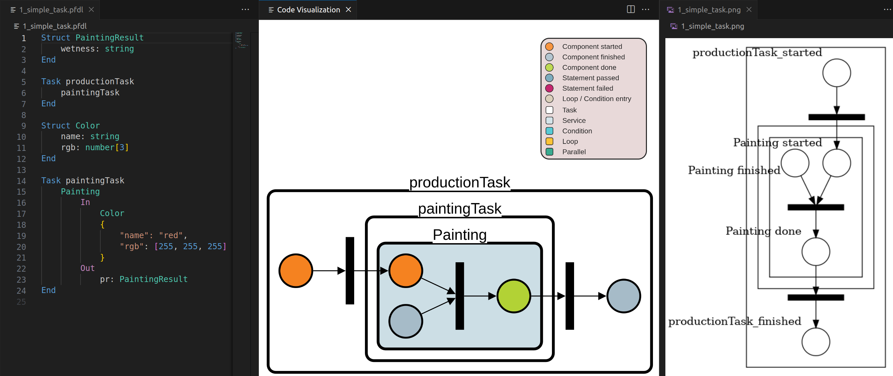

<!--
SPDX-FileCopyrightText: The PFDL VS Code Extension Contributors
SPDX-License-Identifier: MIT
-->

# VS Code Extension for the Production Flow Description Language (PFDL)


[](https://api.reuse.software/info/github.com/iml130/pfdl-vscode-extension)

This extension helps you to develop your [PFDL](https://github.com/iml130/pfdl) programs.

## Table of Contents

<!-- TOC depthFrom:2 depthTo:2 updateOnSave:false -->

- [Features](#features)
  - [PFDL Language Support](#pfdl-language-support)
  - [Code Visualization](#code-visualization)
- [Install](#install)
  - [Requirements](#requirements)
  - [Install from VSIX file](#install-from-vsix-file)
  - [Build it yourself](#build-it-yourself)
  - [Notes for developers](#notes-for-developers)
- [Usage](#usage)
  - [PFDL Language Support](#pfdl-language-support-1)
  - [Generate Code Visualization](#generate-code-visualization)
  - [Webview Interaction](#webview-interaction)
- [Examples](#examples)
- [Architecture](#architecture)
- [Known Issues](#known-issues)
- [Troubleshooting](#troubleshooting)
- [Release Notes](#release-notes)
- [License](#license)

## Features

- [Language support for the Production Flow Description Language](#pfdl-language-support), including

  - [Syntax Highlighting](#syntax-highlighting)
  - [Language Configuration](#language-configuration-and-auto-completion) (right level identation and auto closing)
  - [Auto Completion](#language-configuration-and-auto-completion)
  - [Display of Errors](#display-of-errors)

- [Code Visualization](#code-visualization) next to the corresponding PFDL code in a webview
  - [Component Interactions](#component-interactions)
  - [Interaction with VS Code](#interaction-with-vs-code)
    - [Generate the Code Visualization](#generate-the-code-visualization)
    - [Download the Visualized Code locally](#download-the-visualized-code-locally)
  - [Hot Reload on Save](#hot-reload-on-save)

### PFDL Language Support

#### Syntax Highlighting

Syntax highlighting is provided for the [PFDL grammar](https://iml130.github.io/pfdl/pfdl/introduction/) to support the reading/writing of PFDL programs.
This includes *Task*s, *Struct*s, *Service*s, *Parallel*s, *Condition*s and *Loop*s as well as comments. See some examples below.

|  |  |
| :------------------------------------------------------------------------------------------------: | :-------------------------------------- |

#### Language Configuration and Auto Completion

Auto-completion is provided for the PFDL grammar. This also includes closing code-blocks, e.g., _End_ to close a Task or Struct declaration. Correct identations are also inserted when entering a new line.


#### Display of Errors

Opening or modifying PFDL code triggers error detection. Detected errors are highlighted in the code and listed in the _Problems_ tab of VS Code.


### Code Visualization

The PFDL Scheduler automatically generates a graphical representation of the corresponding PFDL program. This extension provides a dynamic webview of this static representation for use during development. This code visualization can be displayed next to the PFDL program and is updated reactively on file changes. The orientation of the graph can be chosen between horizontal and vertical, whichever is more convenient for you!


#### Component Interactions

Any of the graph nodes (including the single nodes, transition nodes and containers) can be grabbed and moved, while node overlap is prohibited. The labels for individual nodes are hidden for readability reasons and are only displayed when the mouse is over them. Box labels are displayed by default but can be hidden as well.


As your PFDL program grows and becomes more and more complex, the visualization will also become more confusing. It may be helpful to collapse large components into a single one. Within the webview, you can select a specific component to collapse or choose to collapse all components at once. There is also an option to collapse only the top level components, i.e., those that are nested the deepest. Expanding nodes again is done accordingly. Try it out!


#### Interaction with VS Code

Whenever a PFDL program is open in the active text editor in VS Code, the two buttons that are shown in the image below will appear in the top right corner.


##### Generate the Code Visualization

_Visualize Code_ displays a graph visualizing the PFDL program of the _.pfdl_ file in the active editor as described [above](#code-visualization). You can also use this option again to reload the visualization after making some unwanted changes.

##### Download the Visualized Code locally

_Download PNG_ will create a _.png_ file of the currently displayed graph, i.e., it will contain any changes that you may have made, and will ask where to save it on your local system.

#### Hot Reload on Save

The graph with the visualized code is always updated when the PFDL program is saved. If the file contains errors, the error messages are displayed instead.


## Install

To install the extension, use the already built extension file in the build folder or build it yourself. Use the latest build for the best experience. There are also some additional tools required that need to be installed before use.

### Requirements

- [Python](https://www.python.org/) (>= v3.10)
- [GraphViz](https://graphviz.org/) (>= v2.42.2)
- Pip packages from requirements.txt(install with `pip install -r requirements.txt`)
  - [ANTLR4](https://github.com/antlr/antlr4) (== v4.9.3)
  - [antlr-denter](https://github.com/yshavit/antlr-denter) (>=v1.3.1)
  - [SNAKES](https://github.com/fpom/snakes) (>=v0.9.30)
- (For development only) [NodeJS](https://nodejs.org/en/) (>=v18.17.1)

### Install from VSIX file

Installing the extension from an already built VSIX file is the easiest and fastest way to test the extension. Find the current version as the artifact of the newest build pipeline in the repository. Then just open the Extensions tab in VS Code and find the dialogue shown in the image below.


### Build it yourself

You can also build the project directly after downloading the extension repository.
Just follow these steps:

- Install [vsce](https://github.com/microsoft/vscode-vsce): `npm install -g vsce`
- Make sure you are in the project root directory, then run
  `vsce package --out "./pfdl-vs-code-extension-<version_number>.vsix"`.
  Replace <version_number> with your version number
- **Note**: It should have a specific format like described [here](https://semver.org/)

This will create a _.vsix_ in the root directory of your project.

### Notes for Developers

If you want to run this project directly in VS Code or want to debug it during development the first step is to initialize the submodules. This project uses the [PFDL Scheduler](https://github.com/iml130/pfdl), include it with:

`git clone --recurse-submodules git@github.com:iml130/pfdl.git`
`git submodule update --init --recursive`

To finally set up the project, run `npm install` in the project root folder. A folder called _node_modules_ should be installed. Afterwards, run `npm run compile` to generate javascript files out of the typescript code. Now you can run/debug the extension by selecting and running `Client+Server` in the debug window. This should open a new window (the [Extension Development Host](https://code.visualstudio.com/api/get-started/your-first-extension)) where you can open _.pfdl_ files and test the extension.

## Usage

### PFDL Language Support

The extension is used to help you with your _.pfdl_ files. Opening a file with this ending will automatically enable the editor features [syntax highlighting](#syntax-highlighting), [language configuration](#language-configuration-and-auto-completion), [auto-completion](#language-configuration-and-auto-completion) and [displaying of error messages](#display-of-errors).

### Generate Code Visualization

To [graphically visualize the code](#code-visualization) for a PFDL program, make sure the file is open in the active VS Code editor. As described [here](#interaction-with-vs-code), you can view and download a displayed graph by clicking one of the buttons that appear. Saving a _.pfdl_ file will also display an updated version of the visualization. Note that

- If a PFDL program is already visualized, it will be replaced when the webview is updated. Any visual changes to the previously displayed graph will be discarded.
- A code visualization must always be drawn and displayed in the webview before it can be downloaded. I.e., you can't download a graph that hasn't been drawn yet.
- The _Download PNG_ button will always download the **currently visible** graph, even if the active text editor contains a different PFDL program!

### Webview Interaction

|                 Action                 |                                                                                                                                                    Description                                                                                                                                                     |
| :------------------------------------: | :----------------------------------------------------------------------------------------------------------------------------------------------------------------------------------------------------------------------------------------------------------------------------------------------------------------: |
|               Move nodes               |                                                                                                                          Use drag and drop to move individual nodes and groups of nodes.                                                                                                                           |
|                Zooming                 |                                                                                                                               Use the mouse wheel to zoom in and out of the webview.                                                                                                                               |
|         Display a node's label         |                                                                                                                             Hover over a single / container node to display its label.                                                                                                                             |
|          Collapse a compound           |                                                                                                            Click into a compound to collapse all the nodes inside it into a single representation node.                                                                                                            |
|      Collapse multiple compounds       | Right click on the background to bring up the context menu. Then select either _Collapse&nbsp;all&nbsp;Nodes_ to collapse all nodes into a single compound (the _productionTask_) or _Collapse&nbsp;Nodes&nbsp;at&nbsp;highest&nbsp;level_ to collapse only the deepest nested compound nodes in the current view. |
|           Expand a compound            |                                                                                                                  Click into a collapsed compound to reveal any previously hidden nodes inside it.                                                                                                                  |
|       Expand multiple compounds        |         Right click on the background to bring up the context menu. Then select either _Expand&nbsp;all&nbsp;Nodes_ to expand all previously collapsed nodes, or _Expand&nbsp;Nodes&nbsp;at&nbsp;lowest&nbsp;level_ to expand only those compound nodes that are the flattest nested in the current view.          |
|        Rotate the graph by 90°         |                                                                   Right click on the background to bring up the context menu. Then choose _Rotate&nbsp;View_ to change the orientation of the graph from vertical to horizontal and vice versa.                                                                    |
|          Rescale the webview           |                                                          If you want to rescale the webview to show the whole program again after some interactions, right-click on the background to bring up the context menu and choose _Rescale&nbsp;the&nbsp;view_.                                                           |
| Dowload the current code visualization |                                                           This has the same effect as clicking the _Download&nbsp;PNG_ button in VS Code. Right click on the background to bring up the context menu and choose _Download&nbsp;graph&nbsp;as&nbsp;PNG_.                                                            |
|       Hide compound node labels        |                                        The compound node labels are shown by default. To hide them, right-click on the background to bring up the context menu and select _Show&nbsp;/&nbsp;Hide&nbsp;Box&nbsp;Labels_. Selecting this option again will undo this action.                                         |

## Examples

Here are some examples of graphs generated from _.pfdl_ files of increasing complexity. To get a better idea of how useful the code visualization can be when developing PFDL programs, the original Scheduler-generated graph from the example files is shown in the rightmost column. Feel free to try out the following examples with the extension as well. You can find them [here](example_programs).

The _Task_ [_1_simple_task_](example_programs/1_simple_task.pfdl) is not that complex and therefore, can also be understood with the simple PNG generated by the PFDL Scheduler. However, a comparison with the code visualization generated by the extension already shows the advantages of clustering and coloring components instead of displaying each of the node's label. In this example we have chosen to use the horizontal display of the graph.  


For the _Task_ [_2_intermediate_task_](example_programs/2_intermediate_task.pfdl) we manually collapsed all the individual _Services_ as they all have the same structure and this makes it easier to focus on what the PFDL program is supposed to do. We also hovered over the condition node to display the specific condition. The other information needed to read the visualized code can be obtained from the compound labels and the node colors.


The PFDL program for the _Task_ [_3_complex_task_](example_programs/3_complex_task.pfdl) is too long to display nicely. You can find it in the [_example_programs_](example_programs) directory, along with the other examples. We tried again to make some space by collapsing and moving nodes, this time by using the _Collapse&nbsp;Nodes&nbsp;at&nbsp;highest&nbsp;level_ option twice. After moving the nodes together, we used the _Rescale&nbsp;the&nbsp;view_ command to zoom in as much as possible while the whole graph can still be observed on the screen. Of course, we lose information by repeatedly collapsing compound nodes, but this may be acceptable when trying to get an overall view of the PFDL program first. Later, when we want to focus on the details, we can always expand them again.  


## Architecture

The extension mainly consists of a server, which acts as an observer for the active VS Code instance and is responsible for code completion, and a corresponding client, which is informed about changes by the server and is responsible for creating the webview where the code visualization is displayed. The server also communicates with the PFDL scheduler to initiate the generation of new _.dot_ files when necessary.

When a PFDL program is opened/modified, the server calls the scheduler to validate the file in the active VS Code editor and passes the validation result to the client. The following figure illustrates this interaction.


When a _.pfdl_ file is saved or the _Visualize Code_ button is clicked, the request to visualize the code is passed to the client, as shown in the figure below. The client decides whether to generate the graph or to display error messages received before from the server in the webview.


## Known Issues

- A _curvy_ edge that is part of a code visualization may disappear when its source or target node is moved. This is intended by the graph library, when the edge would otherwise form into angles that are impossible to draw. This problem usually occurs when nodes are moved towards each other. Moving them back will make the edge visible again. The image below shows an example of such a _curvy_ edge.

  

## Troubleshooting

The server does not start/the debugger cannot connect to it

> Try changing the port used in the launch.json file in the .vscode folder. Note: You also need to change the port in the extension.ts file.

Errors while running/debugging the extension

> Make sure that you have installed all the programs and packages listed in the requirements section. Some parts will work even if you have not installed everything.

No graph is generated/there is an error when visualizing the code

> Check that you have installed GraphViz correctly (on Windows you need to put the bin folder inside the GraphViz folder in the PATH environment variable. On Ubuntu it should be fine if you install GraphViz via apt-get).

> Sometimes the analysis of the PFDL program may still be in progress, especially if the _.pfdl_ file is large. In this case you should get an error message. A retry after a few moments should normally work as expected.

The program crashes and it has something to do with the Scheduler the extension uses

> To display errors and to generate the code visualization, the extension calls the [Scheduler](https://github.com/iml130/pfdl). The Scheduler is still under development, so there may be bugs. If the extension crashes because of the Scheduler please open an issue in that repo.

## Release Notes

For each release, a `.vsix` installation file for VS Code is provided, as well as a `bundle.js` source code file, containing the code that is responsible for the code visualization.

Additionally, a license file is generated using the [OSS Review Toolkit (ORT)](http://oss-review-toolkit.org/ort/) to automatically collect and summarize licenses and copyright information declared in the dependencies of this project (excluding `devDependencies` for npm). The file can be reproduced by following the [ORT installation guide](http://oss-review-toolkit.org/ort/docs/getting-started/installation) and running the following commands from inside the downloaded ORT repository:

```
cli/build/install/ort/bin/ort analyze -i path/to/pfdl-vs-code-extension -o path/to/output/directory

cli/build/install/ort/bin/ort -P ort.enableRepositoryPackageCurations=true -P ort.enableRepositoryPackageConfigurations=true -P ort.scanner.skipExcluded=true scan -i path/to/output/directory/analyzer-result.yml -o path/to/output/directory

cli/build/install/ort/bin/ort report -f PdfTemplate -i path/to/output/directory/scan-result.yml -o path/to/output/directory
```

Note that the copyright information of this project found by ORT are not complete and had to be completed manually.

### v0.1.0

- First release

### v0.1.1

- Code Visualization: Provide global methods that can be accessed by external modules
- Achieve REUSE compliance for the project
- Add github workflows

## License

VS Code Extension for the Production Flow Description Language (PFDL) is licensed under the MIT License. See [LICENSE](LICENSE) for details on the licensing terms.
